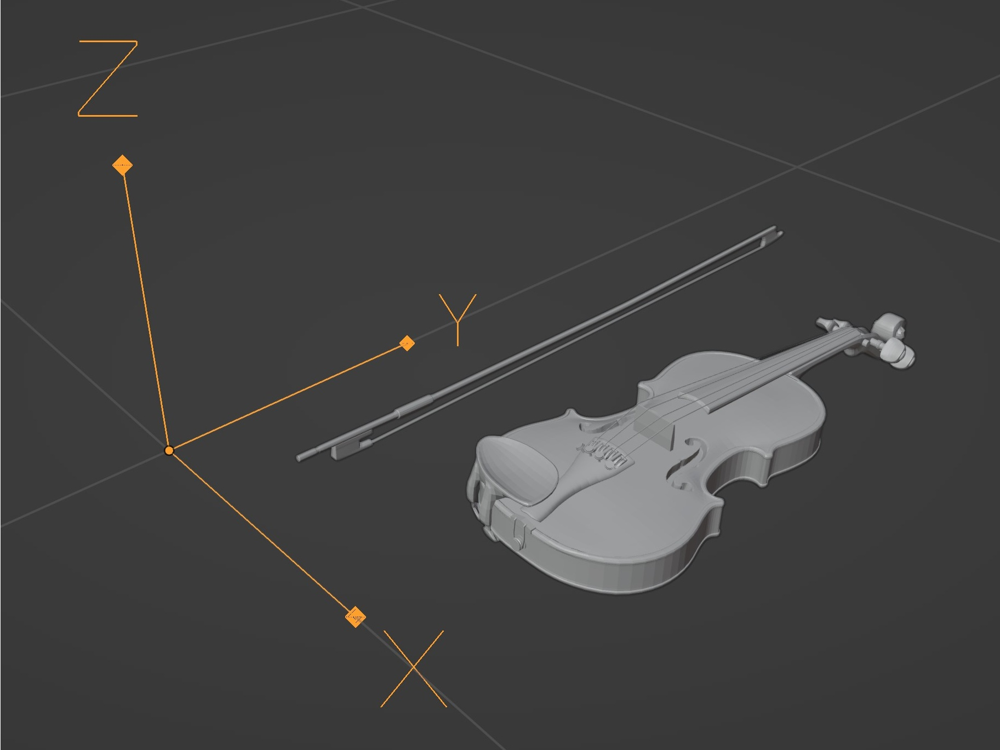

# Musical Instrument Animation

A tool for importing hand animation recorded with *Hand Capture*. 

## Installation 

**Requirements**: Blender 4.0.0 or newer.

To instal the add-on, go to Edit > Preferences > Add-ons and click on *Install...* button. Then select the .zip file with this add-on and click *install*.

## Usage

After instaling and enabling the add-on, you should see *Musical Instrument Animation* tab in the 3D Viewport right menu (press N to show/hide the menu).

### Import Hand Animation

This tab serves for importing hand animation recorded with the *Hand Capture* application and joining it with the armature exported from Motive. 

To import hand animation:
1) set desired palm size,
2) select the target armature and bones,
3) make sure, that the selected armature has scale 1,
4) click *Import Hands* and select the hand animation JSON source file.

### Align Violin and Bow

This tab serves for aligning 3D models with markers imported from Motive.

To align a model:
1) import model,
2) set axis of model to be the same as in image bellow,
3) select imported rigidbody and markers (top plate markers for violin must be in clockwise order),
4) add a empty as a child to the model and position it to match some marker on the real object,
5) set that empty and corresponding reference marker in the *Align* tab,
6) click *Align* button.

